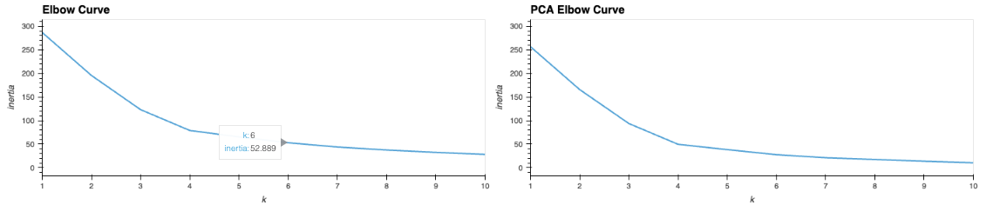
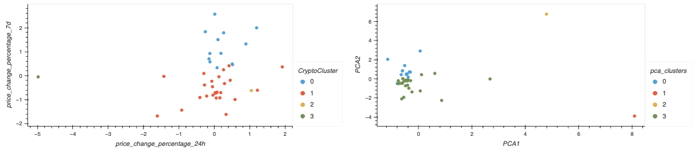

# CryptoClustering
Module 19 Challenge

## Background
In this challenge, we used our knowledge of Python and unsupervised learning to predict if cryptocurrencies are affected by 24-hour or 7-day price changes.

## Data Source
[crypto_market_data.csv](Resources/crypto_market_data.csv)

## Instructions
#### 1. Prepare the Data
* Use the StandardScaler() module from scikit-learn to normalize the data from the CSV file.
* Create a DataFrame with the scaled data and set the "coin_id" index from the original DataFrame as the index for the new DataFrame.

#### 2. Find the Best Value for k Using the Original Scaled DataFrame and the elbow method.

* Using the original dataset, the line curve shows that the best value for k is 4.

#### 3. Cluster Cryptocurrencies with K-means Using the Original Scaled Data

#### 4. Optimize Clusters with Principal Component Analysis

#### 5. Find the Best Value for k Using the PCA Data
* The best value for k when using the PCA data is 4. This is the same as the original data. 

####  6. Cluster Cryptocurrencies with K-means Using the PCA Data

#### 7. Visualize and Compare the Results

* Contrast elbow curves

* Contrast clusters

## Conclusion: 
Using fewer features to cluster the data (PCA) reduces the noise and makes it clearer that this data has two clusters. Without PCA the data appears to probably be in two clusters, but it's not clear or certain. Using the PCA we have greater confidence in what we're seeing.

